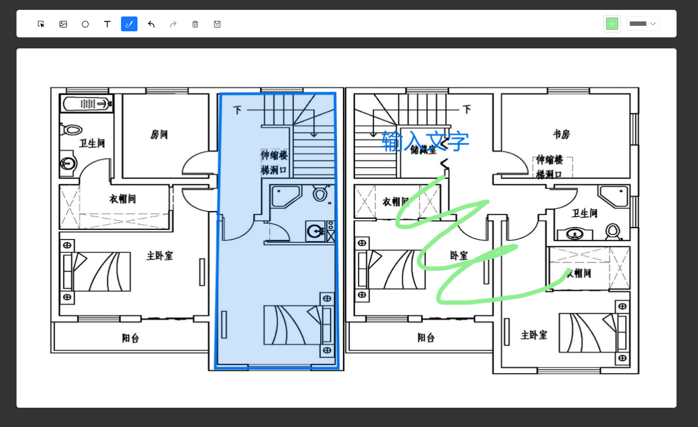

<!--
 * @Author: none
 * @Date: none
 * @LastEditors: chapter2
 * @LastEditTime: 2023-12-05 17:14:18
 * @Description: none
-->

# 基于 fabric 的图片标注工具

## 主要功能

- 选择本地照片作为底图
- 画笔绘制
- 多边形区域绘制
- 文字标注
- 导出为图片
- 切换画笔粗细和颜色
- 撤销恢复功能
- 删除选中对象
- 导出为图片

如果对您有帮助，欢迎 star，谢谢
